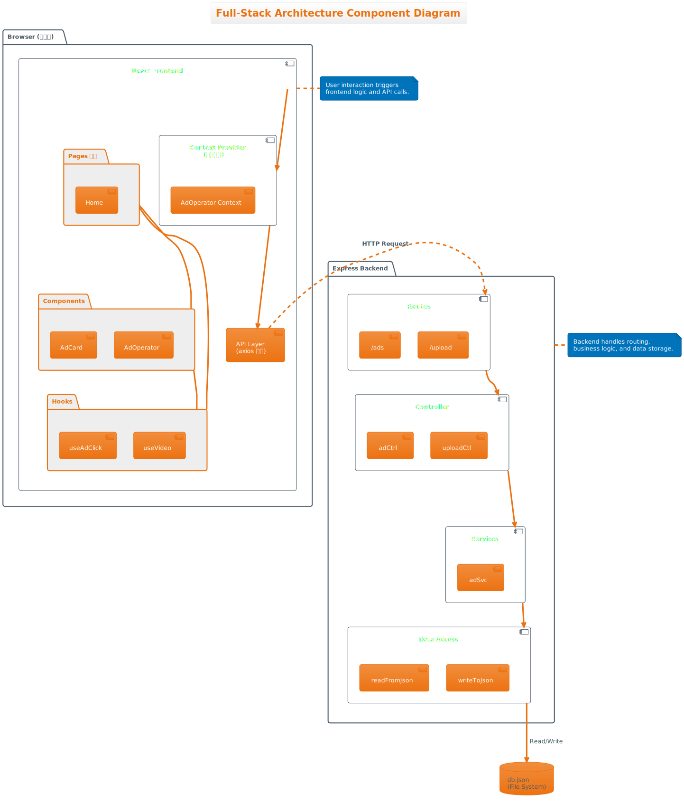
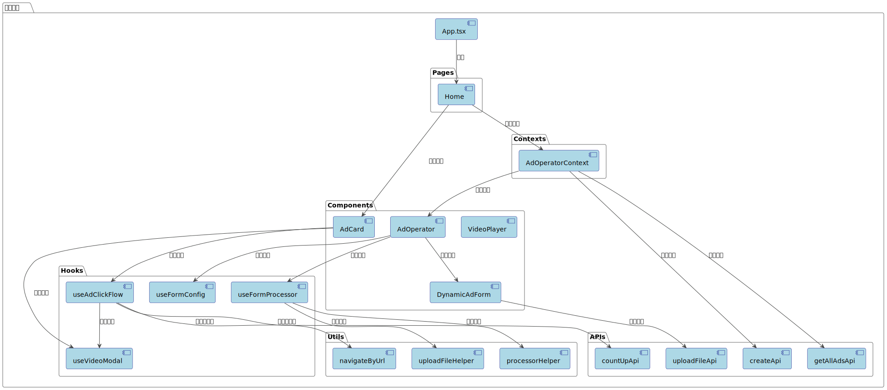
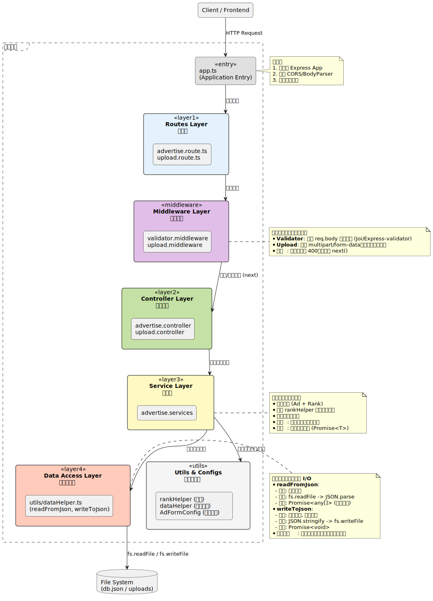
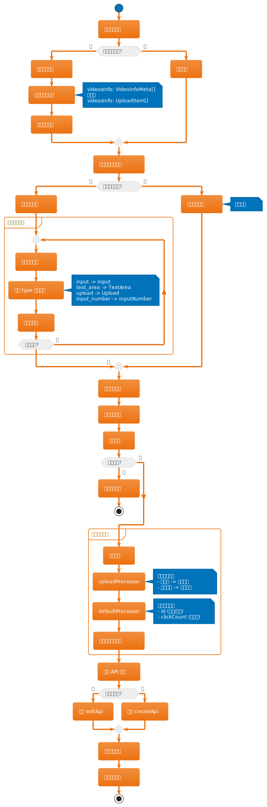
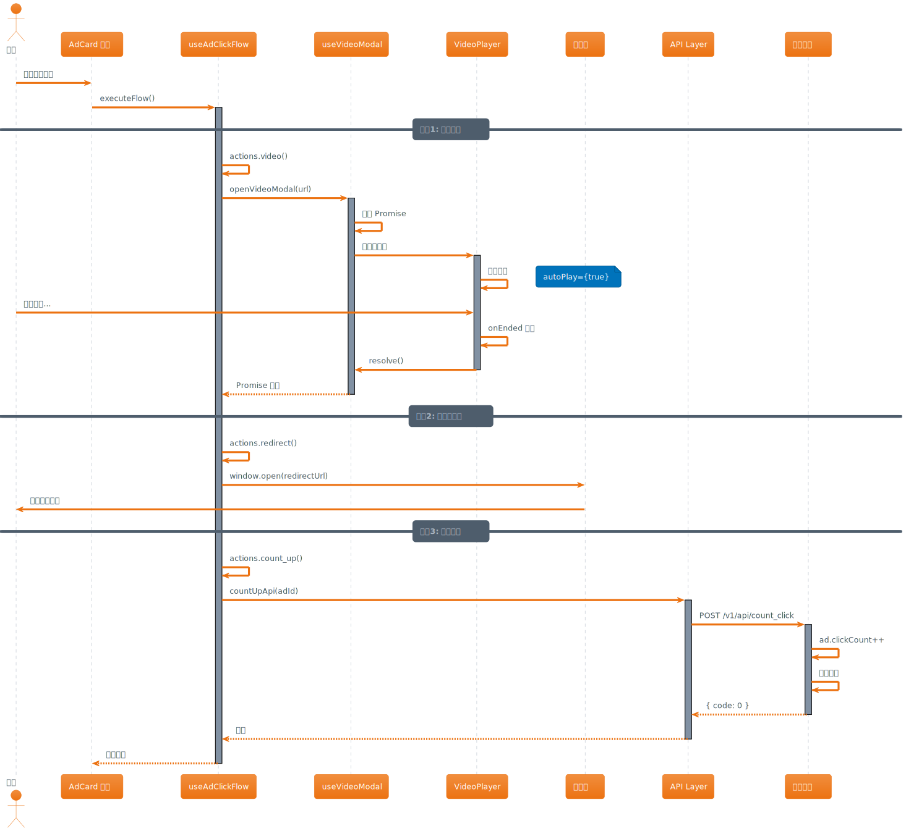

# Mini-Advertisement 项目开发文档

## 📑 目录

- [1. 项目概述](#1-项目概述)
- [2. 技术选型](#2-技术选型)
- [3. 架构设计](#3-架构设计)
- [4. 复杂逻辑实现](#4-复杂逻辑实现)
- [5. 数据流设计](#5-数据流设计)
- [6. 核心功能模块](#6-核心功能模块)
- [7. 历史表单配置缓存系统](#7-历史表单配置缓存系统)

---

## 1. 项目概述

### 1.1 项目背景

Mini-Advertisement 是一个轻量级的广告管理系统，支持广告的创建、编辑、展示和统计功能。系统通过视频广告的方式进行营销推广，用户点击广告后会先观看视频，随后跳转到落地页。

### 1.2 核心功能

- 📝 **广告管理**: 创建、编辑、删除广告
- 🎬 **视频播放**: 支持多视频上传，播放后自动跳转
- 📊 **数据统计**: 记录广告点击量
- 🏆 **智能排序**: 基于出价和点击量的加权排序算法
- ⚙️ **动态表单**: 可配置化的表单字段

### 1.3 技术亮点

1. **前后端完全分离**，支持独立部署
2. **TypeScript 全栈开发**，类型安全
3. **动态表单配置系统**，支持后端控制前端表单结构
4. **文件批量上传优化**，减少网络请求
5. **Context API 全局状态管理**

---

## 2. 技术选型

### 2.1 前端技术栈

| 技术        | 版本   | 选型理由                                                       |
| ----------- | ------ | -------------------------------------------------------------- |
| React       | 18.3.1 | 组件化开发，生态成熟；Hooks 简化状态管理；虚拟 DOM 性能优秀    |
| TypeScript  | 5.9.3  | 静态类型检查减少运行时错误；智能提示提升效率；接口约束便于协作 |
| Vite        | 7.2.4  | 极速冷启动（原生 ESM）；HMR 快；开箱 TS 支持                   |
| Arco Design | 2.66.8 | 组件丰富；TS 友好；UI 美观                                     |
| Axios       | 1.13.2 | 基于 Promise 的 HTTP；拦截器统一处理；自动 JSON                |
| ahooks      | 3.9.6  | 常用 Hooks；useRequest 简化数据请求                            |

### 2.2 后端技术栈

| 技术           | 版本    | 选型理由                                                                         |
| -------------- | ------- | -------------------------------------------------------------------------------- |
| **Node.js**    | ≥14.0.0 | - JavaScript 全栈开发<br>- 异步 I/O，高并发处理<br>- npm 生态丰富                |
| **Express**    | 4.17.1  | - 轻量级 Web 框架<br>- 中间件机制灵活<br>- 社区成熟，文档完善                    |
| **TypeScript** | 4.5.4   | - 与前端统一技术栈<br>- 类型约束提升代码质量                                     |
| **Multer**     | 2.0.2   | - 处理 multipart/form-data<br>- 支持文件上传<br>- 配置灵活（存储位置、文件名等） |
| **Nodemon**    | 3.1.11  | - 后端服务热更新开发体验                                                         |

### 2.3 数据存储方案

**选择 JSON 文件存储的原因**：

- ✅ **轻量级**: 无需额外安装数据库
- ✅ **快速开发**: 读写逻辑简单
- ✅ **易于调试**: 直接查看 `db.json` 文件
- ⚠️ **局限性**: 不支持高并发，不适合生产环境

**未来改进方向**：

- 替换为 MongoDB（文档型数据库，适合广告元数据）
- 或 PostgreSQL（关系型数据库，支持复杂查询）

---

## 3. 架构设计

### 3.1 整体架构图



### 3.2 前端架构设计



#### 3.2.1 目录结构

```
//主要结构
src/
├── apis/                   # API 接口层
│   └── index.ts           # 所有 API 请求
├── components/            # 可复用组件
│   ├── AdCard/           # 广告卡片
│   ├── AdOperator/       # 广告编辑器（核心组件）
│   └── VideoPlayer/      # 视频播放器
├── contexts/             # 全局状态管理
│   └── AdOperator/       # 广告操作 Context
├── hooks/                # 自定义 Hooks
│   └── useAdClickFlow.ts #点击流程控制
├── pages/                # 页面组件
│   └── Home.tsx          # 首页
├── routes/               # 路由配置
├── types/                # TypeScript 类型定义
│   ├── entity.ts         # 实体类型
│   └── form.ts           # 表单类型
└── utils/                # 工具函数
    ├── navigateByUrl.ts      # 跳转辅助函数
    ├── processorHelper.ts    # 数据处理管道
    ├── uploadFileHelper.ts   # 文件上传优化
    └── requestHelper.ts      # 请求封装
```

#### 3.2.2 组件设计原则

1. **单一职责**: 每个组件只负责一个功能
2. **高内聚低耦合**: 通过 Props 和 Context 传递数据
3. **可测试性**: 纯函数组件，便于单元测试

#### 3.2.3 状态管理策略

- **全局状态**: 使用 Context API（广告列表、操作方法）
- **组件状态**: 使用 useState（UI 交互、表单输入）
- **服务端状态**: 使用 ahooks 的 useRequest（数据请求）

### 3.3 后端架构设计



#### 3.3.1 目录结构

```
src/
├── app.ts                      # 应用入口文件 (Express App 初始化)
├── configs/                    # 配置文件目录
│   └── AdFormConfig.ts         # 动态表单字段配置
├── controllers/                # 控制器层 (处理 HTTP 请求与响应)
│   ├── advertise.controller.ts # 广告相关接口控制器
│   └── upload.controller.ts    # 文件上传接口控制器
├── routes/                     # 路由层 (定义 API 端点)
│   ├── advertise.route.ts      # 挂载广告相关路由
│   └── upload.route.ts         # 挂载上传相关路由
├── services/                   # 服务层 (核心业务逻辑)
│   └── advertise.services.ts   # 广告数据的 CRUD 与排序逻辑处理
├── middlewares/                # 中间件层 (请求预处理)
│   ├── upload.middleware.ts    # 文件上传中间件 (Multer 配置)
│   └── validator.middleware.ts # 请求参数校验中间件
├── utils/                      # 工具函数与辅助类
│   ├── dataHelper.ts           # JSON 数据读写辅助函数 (DAL)
│   ├── rankHelper.ts           # 广告排序算法实现
│   └── validator.ts            # src/
├── app.ts                      # 应用入口文件 (Express App 初始化)
├── configs/                    # 配置文件目录
│   └── AdFormConfig.ts         # 动态表单字段配置
├── controllers/                # 控制器层 (处理 HTTP 请求与响应)
│   ├── advertise.controller.ts # 广告相关接口控制器
│   └── upload.controller.ts    # 文件上传接口控制器
├── routes/                     # 路由层 (定义 API 端点)
│   ├── advertise.route.ts      # 挂载广告相关路由
│   └── upload.route.ts         # 挂载上传相关路由
├── services/                   # 服务层 (核心业务逻辑)
│   └── advertise.services.ts   # 广告数据的 CRUD 与排序逻辑处理
├── middlewares/                # 中间件层 (请求预处理)
│   ├── upload.middleware.ts    # 文件上传中间件 (Multer 配置)
│   └── validator.middleware.ts # 请求参数校验中间件
├── utils/                      # 工具函数与辅助类
│   ├── dataHelper.ts           # JSON 数据读写辅助函数 (DAL)
│   ├── rankHelper.ts           # 广告排序算法实现
│   └── validator.ts            #
```

#### 3.3.2 分层架构

```
┌──────────────┐
│   Routes     │  路由定义，参数解析
├──────────────┤
│  Controller  │  请求处理，响应封装
├──────────────┤
│   Services   │  业务逻辑，数据操作
├──────────────┤
│ Data Access  │  数据持久化（JSON/DB）
└──────────────┘
```

**设计理由**：

- **职责分离**: 每层只关注自己的职责
- **易于测试**: 可以单独测试每一层
- **易于扩展**: 替换数据库只需修改 Data Access 层

---

## 4. 复杂逻辑实现

### 4.1 动态表单配置系统

#### 4.1.1 设计目标

- 前端表单字段由后端配置决定
- 支持动态添加/删除字段
- 支持不同字段类型（输入框、文本域、上传、数字）

#### 4.1.2 实现原理

**后端配置文件**（`src/configs/AdFormConfig.ts`）：

```typescript
export const AdFormConfig = {
  fields: [
    {
      name: "title", // 字段名
      label: "广告标题", // 显示文本
      type: "input", // 组件类型
      rules: [
        // 验证规则
        { required: true, message: "请输入广告标题" },
      ],
      component_props: {
        // 组件属性
        placeholder: "请输入广告标题",
      },
    },
    {
      name: "videosInfo",
      label: "上传视频",
      type: "upload",
      rules: [{ required: true, message: "请上传视频" }],
      item_props: {
        // FormItem 属性
        triggerPropName: "fileList",
      },
      component_props: {
        listType: "picture-card",
        multiple: true,
        autoUpload: false,
      },
    },
    // ... 其他字段
  ],
};
```

**前端动态渲染**（`DynamicAdForm.tsx`）：

```typescript
const ComponentByType: Record<FieldType, React.FC> = {
  input: Input,
  text_area: TextArea,
  input_number: InputNumber,
  upload: Upload,
};

const renderField = (field: FieldConfig) => {
  const { type, component_props = {} } = field;
  const Component = ComponentByType[type] || Input;
  return <Component {...component_props} />;
};

// 循环渲染表单
{
  fieldConfigs.map((field) => (
    <FormItem
      key={field.name}
      field={field.name}
      label={field.label}
      rules={field.rules}
      {...field.item_props}
    >
      {renderField(field)}
    </FormItem>
  ));
}
```

#### 4.1.3 数据处理管道

**问题**:
某些字段在**表单项组件**上的类型与**广告元数据**对应字段类型不符(如: `Upload`组件类型在上传文件后其对象类型内有 File 类型的对象,该对象不能存储在 BE 的 JSON 中因此元数据中对应字段主要以其**上传到后端的 url**表示)

因此在提交表单时需要做到表单类型到接口类型的转换,不同字段类型需要不同的数据处理逻辑

例如:

- `input` → 直接使用
- `upload` → 需要上传文件获取 URL

**解决方案**: 使用**处理器管道**（Pipeline Pattern）

```typescript
// 定义处理器类型
export type AdFormProcessor = (
  data: Partial<AdFormValues>,
  config: FieldConfig[]
) => Promise<Partial<AdFormValues>>;

// 文件上传处理器
export const uploadProcessor: AdFormProcessor = async (values, config) => {
  const result = { ...values };
  const uploadFields = config.filter((field) => field.type === "upload");

  for (const field of uploadFields) {
    const files = values[field.name] as UploadItem[];
    if (files) {
      result[field.name] = await washVideoFile(files);
    }
  }
  return result;
};

// 默认处理器（补充 id、clickCount 以及处理 当是从编辑或辅助进入表单时因此返回值是函数）
export const createDefaultProcessor = (
  initialValues?: AdvertisementMeta
): AdFormProcessor => {
  return (value) => ({
    ...value,
    id: initialValues?.id || Date.now().toString(),
    clickCount: initialValues?.clickCount || 0,
  });
};

// 创建管道
const formProcessor = createPipeline(uploadProcessor, defaultProcessor);

// 执行管道
const processedData = await formProcessor(formValues, fieldConfig);
```

**优势**：

- ✅ 解耦：每个处理器独立
- ✅ 可扩展：新增字段类型只需添加处理器
- ✅ 可测试：单独测试每个处理器

#### 4.1.4 表单状态同步

**问题**: 编辑时需要将元数据转换为表单数据

```typescript
// 元数据格式
interface AdvertisementMeta {
  videosInfo?: VideoInfoMeta[]; // { url, name, uid }
}

// 表单格式
interface AdFormValues {
  videosInfo?: UploadItem[]; // { url, name, uid, status,...}
}
```

**解决方案**: 使用 `useEffect` 监听数据变化

```typescript
useEffect(() => {
  if (visible && initialValues) {
    const formValues: AdFormValues = {
      ...initialValues,
      videosInfo: initialValues.videosInfo?.map((item) => ({
        url: item.url,
        name: item.name,
        status: "done", // 标记为已上传
        uid: item.uid,
      })),
    };
    form.setFieldsValue(formValues);
  } else if (visible && !initialValues) {
    form.resetFields(); // 创建模式清空表单
  }
}, [visible, initialValues, form]);
```

#### 4.1.5 动态表单处理流程图



---

### 4.2 广告点击流程控制

#### 4.2.1 业务流程

```
用户点击广告
    ↓
播放视频（随机选一个）
    ↓
视频播放完毕
    ↓
跳转落地页
    ↓
统计点击量（+1）
```

#### 4.2.2 实现方案

**问题**:
由于表单是通过后端动态配置的因此存在广告间字段不同的情况导致点击不同广告可能触发不同的效果(如:点击带视频的广告会经历 video -> redirect -> count_up,若不带视频的广告则会经历 redirect -> count_up),点击事件的`Flow`是不同的,因此需要具备一定的扩展性(未来可能添加新的有关点击事件字段)以及可维护性来实现该方案

**解决方案**: 通过定义事件流数字 `CLICK_FLOW` 以其索引大小作为事件触发的优先级并通过下来配置后的二次处理使其可以根据其具备的有关点击 Flow 进行点击事件的分配以及顺序执行

```typescript
//事件流数组
const CLICK_FLOW = ["video", "redirect", "count_up"] as const;

export const useAdClickFlow = (ad: AdvertisementMeta, deps) => {
  const { openVideoModal } = deps;

  //事件流字段对应事件函数
  const actions = useMemo(
    () => ({
      video: async () => {
        if (!ad.videosInfo || ad.videosInfo.length === 0) return;
        const randomVideo =
          ad.videosInfo[Math.floor(Math.random() * ad.videosInfo.length)];
        await openVideoModal(randomVideo.url); // 等待视频播放完
      },

      redirect: async () => {
        if (!ad.redirectUrl) return;
        NavigateByUrl(ad.redirectUrl);
      },

      count_up: async () => {
        await countUpApi(ad.id);
      },
    }),
    [ad, openVideoModal]
  );

  //组装事件并执行事件流
  const executeFlow = useCallback(async () => {
    for (const stepName of CLICK_FLOW) {
      const handler = actions[stepName];
      if (handler) {
        await handler(); // 串行执行
      }
    }
  }, [actions]);

  return executeFlow;
};
```

**视频播放完的 Promise 实现**

```typescript
export const useVideoModal = () => {
  const [modal, contextHolder] = Modal.useModal();

  const openVideoModal = (videoUrl: string): Promise<void> => {
    return new Promise((resolve) => {
      modal.info?.({
        content: (
          <VideoPlayer
            videoResource={videoUrl}
            onEnded={() => {
              Modal.destroyAll();
              resolve(); // 播放完才 resolve
            }}
          />
        ),
      });
    });
  };

  return { openVideoModal, contextHolder };
};
```

#### 4.2.3 广告点击流程图



**优势**：

- ✅ 流程清晰：`video → redirect → count_up`
- ✅ 可配置：修改 `CLICK_FLOW` 数组即可调整流程
- ✅ 可扩展：新增步骤只需添加 `actions`

---

### 4.3 文件批量上传优化

#### 4.3.1 业务场景

用户选择多个视频文件时，如果每个文件单独上传，会导致：

- ❌ 网络请求过多（10 个文件 = 10 次请求）
- ❌ 服务器压力大
- ❌ 用户等待时间长

#### 4.3.2 优化策略

**批量上传逻辑**：

```typescript
const fileCache: File[] = []; // 文件缓存
const MAX_CACHE_SIZE = 3; // 达到 3 个文件立即上传
const MAX_CACHE_TIME = 3000; // 或等待 3 秒后上传

export const uploadFileHelper = async (file: File, uploadFn) => {
  fileCache.push(file);

  // 策略1：文件数达到阈值，立即上传
  if (fileCache.length >= MAX_CACHE_SIZE) {
    return await executeBatchUpload(uploadFn);
  }

  // 策略2：启动定时器，3 秒后上传
  if (uploadTimer) clearTimeout(uploadTimer);

  return new Promise((resolve) => {
    uploadTimer = setTimeout(async () => {
      const result = await executeBatchUpload(uploadFn);
      resolve(result);
    }, MAX_CACHE_TIME);
  });
};
```

---

## 5. 数据流设计

### 5.1 前端数据流

```
User Interaction (用户操作)
    ↓
Component Event Handler (事件处理)
    ↓
Context Action (全局操作方法)
    ↓
API Request (网络请求)
    ↓
Backend API (后端接口)
    ↓
Response (响应数据)
    ↓
Context State Update (更新全局状态)
    ↓
Component Re-render (组件重新渲染)
```

**示例: 创建广告**

```typescript
// 1. 用户点击提交按钮
<Button onClick={handleSubmit}>提交</Button>;

// 2. 事件处理 → 调用 Context 方法
const handleSubmit = async (data) => {
  await onSubmit?.(data); // onSubmit 来自 AdOperatorContext
};

// 3. Context 发送请求
const handleSubmit = async (data: AdvertisementMeta) => {
  const existingData = await getAllAdsApi();
  const index = existingData.findIndex((item) => item.id === data.id);

  if (index !== -1) {
    await editApi(data); // 编辑
  } else {
    await createApi(data); // 创建
  }

  refreshAdList(); // 刷新列表
  closeAdOperator(); // 关闭弹窗
};

// 4. 更新状态 → 组件重新渲染
const refreshAdList = async () => {
  const rawAds = await getAllAdsApi();
  setAdList(rawAds); // 触发重新渲染
};
```

### 5.2 后端数据流

```
HTTP Request
    ↓
Express Middleware (中间件处理)
    ↓
Route Handler (路由匹配)
    ↓
Controller (请求验证、参数解析)
    ↓
Service (业务逻辑)
    ↓
Data Access (数据读写)
    ↓
JSON File / Database
    ↓
Response (返回结果)
```

**示例: 创建广告**

```typescript
// 1. 请求进入路由
ad_router.post(CREATE_AD, adController.createAdertiseMent);

// 2. Controller 处理
const createAdertiseMent = async (req: Request, res: Response) => {
  try {
    const adData = req.body;
    await adServices.createAdertiseMent(adData); // 调用 Service
    res.status(201).json({ code: 0, data: null, message: "成功" });
  } catch (error) {
    res.status(500).json({ code: -1, data: null, message: "失败" });
  }
};

// 3. Service 业务逻辑
const createAdertiseMent = async (data: advertisementMeta) => {
  const dbData = await dataAccess.read(); // 读取数据
  const newAds = [...dbData.ads, data];
  dbData.ads = getRankedAds(newAds); // 排序
  await dataAccess.write(dbData); // 写入数据
};

// 4. Data Access 读写文件
export const writeToJson = async (data: DBjson): Promise<void> => {
  await fs.writeFile(DB_PATH, JSON.stringify(data, null, 2), "utf-8");
};
```

### 5.3 数据流时序图


---

## 6. 核心功能模块

### 6.1 广告卡片 (AdCard)

**功能**：

- 展示广告信息（标题、内容、出价、点击量）
- 点击卡片触发点击流程
- 右上角操作按钮（编辑、复制、删除）

**关键代码**：

```typescript
const AdCard = (config: AdvertisementMeta) => {
  const { openVideoModal, contextHolder } = useVideoModal();
  const handleCardClick = useAdClickFlow(config, { openVideoModal });

  return (
    <Card
      title={title}
      extra={<MoreOperate {...config} />}
      hoverable={true}
      onClick={handleCardClick} // 点击触发流程
    >
      <CardContent {...config} />
    </Card>
  );
};
```

**设计亮点**：

- 使用 `onClick` 事件阻止冒泡（`e.stopPropagation()`），避免点击操作按钮时触发卡片点击
- 使用 `hoverable` 属性提升交互体验

---

### 6.2 广告编辑器 (AdOperator)

**功能**：

- 创建/编辑广告
- 动态表单渲染
- 文件上传处理
- 表单验证

**核心逻辑**：

```typescript
const AdOperator = ({ visible, onClose, onSubmit, initialValues }) => {
  const [form] = Form.useForm();
  const { config, loading: configLoading } = useFormConfig(); // 获取配置
  const { processFormData } = useFormProcessor({
    initialValues,
    fieldConfig: config,
  });

  const handleSubmit = async () => {
    const values = await form.validate(); // 验证表单
    const processedData = await processFormData(values); // 处理数据
    onSubmit?.(processedData);
  };

  return (
    <Modal visible={visible} onCancel={onClose}>
      {configLoading ? (
        <Spin tip="加载配置..." />
      ) : config ? (
        <DynamicAdForm
          fieldConfigs={config}
          form={form}
          onSubmit={handleSubmit}
        />
      ) : (
        <DefaultForm /> // 配置加载失败时的降级方案
      )}
    </Modal>
  );
};
```

**降级方案**：

- 配置加载失
  败时，使用硬编码的默认表单
- 确保核心功能可用

---

### 6.3 视频播放器 (VideoPlayer)

**功能**：

- 自动播放视频
- 自定义进度条
- 禁用原生控制（防止用户跳过）
- 静音开关

**关键代码**：

```typescript
const VideoPlayer = ({ videoResource, onEnded }) => {
  const videoRef = useRef<HTMLVideoElement>(null);
  const [progress, setProgress] = useState(0);
  const [isMuted, setIsMuted] = useState(false);

  useEffect(() => {
    const video = videoRef.current;
    const handleTimeUpdate = () => {
      const progress = (video.currentTime / video.duration) * 100;
      setProgress(progress);
    };
    video.addEventListener("timeupdate", handleTimeUpdate);
    return () => video.removeEventListener("timeupdate", handleTimeUpdate);
  }, []);

  return (
    <div className="relative">
      <video
        ref={videoRef}
        src={videoResource}
        autoPlay
        muted={isMuted}
        playsInline
        controlsList="nodownload nofullscreen" // 禁用下载、全屏
        disablePictureInPicture
        onEnded={onEnded} // 播放完触发回调
        onContextMenu={(e) => e.preventDefault()} // 禁用右键
        style={{ pointerEvents: "none" }} // 禁用点击
      />

      {/* 自定义进度条 */}
      <div style={{ width: `${progress}%`, backgroundColor: "#1890ff" }} />

      {/* 静音开关 */}
      <Button
        icon={isMuted ? <IconMute /> : <IconSound />}
        onClick={() => setIsMuted(!isMuted)}
      />
    </div>
  );
};
```

**设计细节**：

- `controlsList` 禁用原生控制，防止用户跳过
- `pointerEvents: "none"` 禁用视频点击
- 自定义进度条保持 UI 一致性

---

## 7. 历史表单配置缓存系统

### 7.1 问题背景

#### 7.1.1 核心问题

当后端修改表单配置后，已创建的广告可能包含**新配置中不存在的字段**，导致：

- ❌ 编辑旧广告时，旧字段无法显示
- ❌ 保存后，旧字段数据丢失
- ❌ 用户体验受损

**示例场景**：

```typescript
// 旧配置（创建广告时）
fields: [
  { name: "title", type: "input" },
  { name: "description", type: "textarea" }, // 已被删除
  { name: "videosInfo", type: "upload" },
];

// 新配置（当前配置）
fields: [
  { name: "title", type: "input" },
  { name: "videosInfo", type: "upload" },
];

// 问题：编辑旧广告时，"description" 字段无法显示和编辑
```

### 7.2 解决方案

#### 7.2.1 设计思路

1. **创建广告时**：缓存当前表单配置
2. **编辑广告时**：优先使用缓存的配置
3. **复制广告时**：优先使用被复制的广告表单配置
4. **删除广告时**：清理对应的配置缓存

#### 7.2.2 核心实现

**数据结构**（`cacheHelper.ts`）：

```typescript
interface FormConfig {
  id: string; // 配置哈希（MD5）
  config: FieldConfig[]; // 完整的表单配置
  refCount: number; // 引用计数
  formIds: string[]; // 使用该配置的表单ID列表
  createAt: number; // 创建时间
  updateAt: number; // 更新时间
}

interface FormConfigCache {
  configs: Record<string, FormConfig>; // 配置哈希 → 配置对象
  formMapping: Record<string, string>; // 表单ID → 配置哈希
}
```

**核心 API**：

```typescript
// 1. 生成配置哈希（用于去重）
const generateConfigHash = (config: FieldConfig[]): string => {
  return CryptoJS.MD5(JSON.stringify(config)).toString();
};

// 2. 缓存表单配置
export const cacheFormConfig = (formId: string, config: FieldConfig[]) => {
  const storage = getStorage();
  const configHash = generateConfigHash(config);

  if (storage.formMapping[formId]) return; // 已存在，直接返回

  if (storage.configs[configHash]) {
    // 已有相同配置，增加引用计数
    storage.configs[configHash].refCount += 1;
    storage.configs[configHash].formIds.push(formId);
    storage.configs[configHash].updateAt = Date.now();
  } else {
    // 新配置，创建记录
    storage.configs[configHash] = {
      id: configHash,
      config,
      refCount: 1,
      formIds: [formId],
      createAt: Date.now(),
      updateAt: Date.now(),
    };
  }

  storage.formMapping[formId] = configHash;
  saveStorage(storage);
};

// 3. 获取缓存的配置
export const getCachedFormConfig = (formId: string): FieldConfig[] => {
  const storage = getStorage();
  const configHash = storage.formMapping[formId];
  return configHash ? storage.configs[configHash].config : [];
};

// 4. 删除配置缓存（引用计数 -1）
export const removeFormConfig = (formId: string) => {
  const storage = getStorage();
  const configHash = storage.formMapping[formId];
  if (!configHash || !storage.configs[configHash]) return;

  const config = storage.configs[configHash];
  config.refCount -= 1;
  config.formIds = config.formIds.filter((id) => id !== formId);

  if (config.refCount <= 0) {
    delete storage.configs[configHash]; // 无引用时删除配置
  }

  delete storage.formMapping[formId];
  saveStorage(storage);
};
```

### 7.3 使用流程

#### 7.3.1 创建广告

```typescript
const handleCreate = async (formValues: AdFormValues) => {
  const processedData = await processFormData(formValues);

  // 1. 创建广告
  await createApi(processedData);

  // 2. 缓存表单配置
  cacheFormConfig(processedData.id, currentFieldConfig);
};
```

#### 7.3.2 编辑/复制广告

```typescript
const { data: config = undefined, loading } = useRequest(
  async () => {
    const rawConfig = initialValues
      ? getCachedFormConfig(initialValues.sourceId || initialValues.id)
      : await getFormConfig();
    return {
      rawConfig,
      processedConfig: processRules(rawConfig),
    };
  },
  {
    refreshDeps: [initialValues?.id],
    cacheKey: initialValues?.id
      ? `form-config-${initialValues.id}`
      : "form-config-new",
  }
);
```

#### 7.3.3 删除广告

```typescript
const handleDelete = async (adId: string) => {
  // 1. 删除广告
  await deleteApi(adId);

  // 2. 清理配置缓存
  removeFormConfig(adId);
};
```

### 7.4 设计优势

#### 7.4.1 性能优化

- ✅ **哈希去重**：相同配置只存储一份，节省空间
- ✅ **引用计数**：自动清理未使用的配置
- ✅ **懒加载**：仅在编辑时加载配置

#### 7.4.2 数据一致性

- ✅ **配置隔离**：每个广告使用独立的配置快照
- ✅ **向后兼容**：旧广告始终能正确展示和编辑
- ✅ **自动同步**：创建/删除时自动维护缓存

#### 7.4.3 可维护性

- ✅ **解耦设计**：缓存逻辑与业务逻辑分离
- ✅ **易于测试**：纯函数实现，便于单元测试
- ✅ **易于扩展**：可轻松添加缓存过期、压缩等功能

### 7.5 缓存流程图

```
创建广告
    ↓
生成配置哈希
    ↓
检查是否存在相同配置
    ├─ 存在 → 引用计数 +1
    └─ 不存在 → 创建新配置
    ↓
保存 formId → configHash 映射
    ↓
存储到 LocalStorage
```

```
编辑广告
    ↓
根据 formId 查找 configHash
    ↓
获取缓存的配置
    ├─ 存在 → 使用缓存配置
    └─ 不存在 → 使用当前配置
    ↓
渲染动态表单
```

```
删除广告
    ↓
根据 formId 查找 configHash
    ↓
引用计数 -1
    ↓
检查引用计数
    ├─ > 0 → 保留配置
    └─ = 0 → 删除配置
    ↓
删除 formId → configHash 映射
    ↓
更新 LocalStorage
```

---

## 8. 总结

### 8.1 技术亮点

1. ✅ **TypeScript 全栈开发**，类型安全
2. ✅ **动态表单配置系统**，灵活可扩展
3. ✅ **历史配置缓存机制**，保证数据完整性
4. ✅ **数据处理管道模式**，解耦业务逻辑
5. ✅ **智能事件流处理**，灵活可扩展

### 7.2 项目价值

- 📚 **学习价值**: 完整的前后端分离项目
- 💼 **商业价值**: 可应用于小型广告投放系统
- 🔧 **技术价值**: 动态表单、管道模式等设计模式

---

**文档版本**: v1.1  
**最后更新**: 2025-12-16
**作者**: jet-isnt-haha
